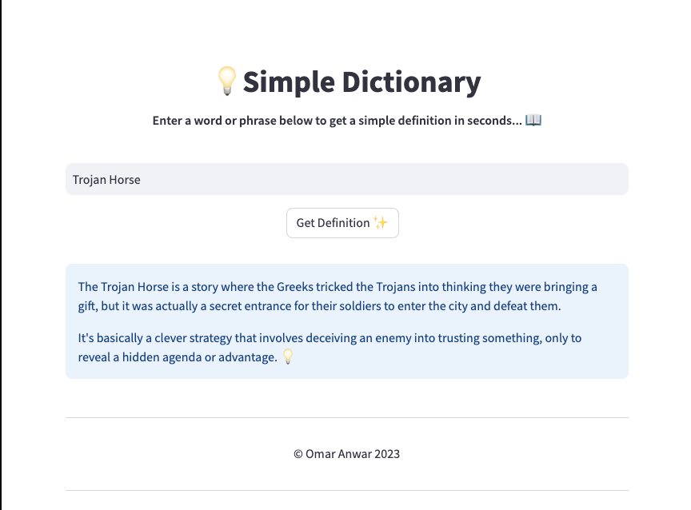

# Simple Dictionary 💡

**Simple Dictionary** is a Streamlit web application that allows you to get quick and straightforward definitions for words or phrases. It utilizes the OpenAI API to provide concise explanations in one sentence.



Simple Dictionary was born out of frustration with learning concepts as a beginner. Often times, when first learning something, online definitions can be overcomplicated and cumbersome. Simple Dictionary provides a solution to this, by providing simple, concise definitions for any word or phrase.

## Getting Started

Before running this application, make sure to set up your environment and API keys.

### Prerequisites

You'll need to install the necessary dependencies by running the following command in the root folder: `pip install -r requirements.txt`

### Setup

1. Clone the repository to your local machine.
2. Create a `.env` file in the root directory and set your OpenAI API key and base URL as follows:

```plaintext
API_KEY=your_openai_api_key
API_BASE=your_openai_api_base_url
```

3. Run the streamlit application using: `streamlit run app.py`

### Usage

- Visit the Streamlit app and enter a word or phrase for which you want a simple definition.
- Click the "Get Definition ✨" button.
- You will receive a concise explanation in one sentence. It's basically [explanation] 💡.

#### Customization

You can customize the behavior of the application by adjusting the model, temperature, and max_tokens parameters in the get_definition function.
